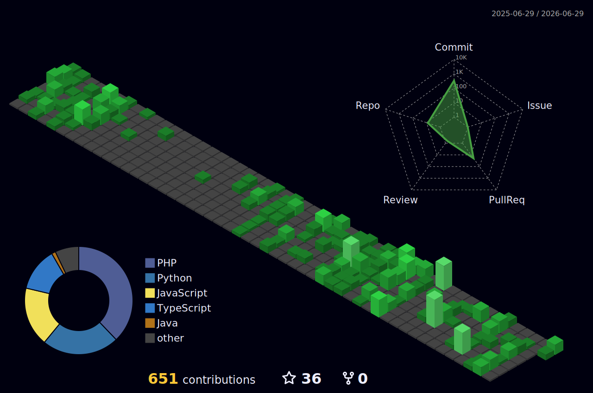

<div align="center">


<br/><br/>

[](https://incandescent-lily-61689f.netlify.app/)
&nbsp;
[](mailto:nipunakaweya@gmail.com)
&nbsp;
[](https://www.linkedin.com/in/nipuna-prabashwara-673b82258/)
&nbsp;
[](https://aimips.tech)
&nbsp;
[](https://getshieldsync.com)

</div>

<br/>

<br/>

## `> whoami`

```text
┌─ identity ───────────────────────────────────────────────────────────┐
│                                                                       │
│  NAME      ›  Nipuna Prabashwara                                      │
│  ROLE      ›  Security Researcher · Full Stack Developer              │
│  DEGREE    ›  BEng Software Engineering — First Class Honours        │
│               University of Westminster / IIT Sri Lanka               │
│                                                                       │
│  RESEARCH  ›  SciSec 2026 (Springer LNCS)        ✓  Accepted         │
│               RAID 2026                           ⟳  Under Review     │
│               ISAAC 2026 (Springer LNCS)          ⟳  Under Review     │
│               ADSACAI 2026 · Univ. of Moratuwa   ✓  Published        │
│                                                                       │
│  SYSTEMS   ›  AIM-IPS    →  aimips.tech                              │
│               ShieldSync  →  getshieldsync.com                        │
│                                                                       │
│  DOMAINS   ›  Application Security  ·  Intrusion Detection           │
│               Zero-Day Research  ·  Blockchain  ·  Cross-Platform    │
│                                                                       │
│  TARGET    ›  MSc / MPhil in Cybersecurity                           │
│               Europe · Japan · Canada · Australia                     │
│                                                                       │
└───────────────────────────────────────────────────────────────────────┘
```

<br/>

<br/>

## `> systems --active`

<table>
<tr>
<td width="50%" valign="top">

### 🔐 AIM-IPS
**Adaptive Intrusion Prevention System**

> *Accepted · SciSec 2026 · Springer LNCS · [aimips.tech](https://aimips.tech)*

Production-deployed middleware IPS:

- **5-layer ML pipeline** — CNN anomaly gate + LightGBM classifier + cross-pipeline temporal correlator
- **Zero-day detection** — Autoencoder, VAE, One-Class SVM, Isolation Forest ensemble
- **Autonomous rule engine** — generates MITRE ATT&CK-mapped WAF rules in real time
- **Graduated response** — 0–100 risk scoring, threat actions under **10ms**

</td>
<td width="50%" valign="top">

### 🛡 ShieldSync
**WordPress WAF & Intrusion Prevention System**

> *Open-source · [getshieldsync.com](https://getshieldsync.com) · [github.com/shieldsync/plugin](https://github.com/shieldsync/plugin)*

Pre-init WordPress firewall — intercepts before CMS loads:

- Defends against **SQLi, XSS, CSRF, brute force, bot traffic, file upload**
- Pro backend: **Laravel + PostgreSQL + Redis + ML anomaly detection**
- **Crowdsourced global IP reputation** network
- Zero-dependency execution before WordPress initialises

</td>
</tr>
</table>

<br/>

<br/>

## `> stack --scan`

<div align="center">

**`[ BACKEND ]`**


**`[ FRONTEND ]`**


**`[ MOBILE ]`**


**`[ DATA ]`**


**`[ SECURITY ]`**


**`[ BLOCKCHAIN ]`**


**`[ ML / RESEARCH ]`**


</div>

<br/>

<br/>

## `> metrics --github`

<div align="center">


</div>

<br/>

<div align="center">

<table border="0">
<tr>
<td>

</td>
<td>

</td>
</tr>
</table>

</div>

## `> activity --log`

<div align="center">
  
</div>

<br/>

<details>
<summary><b><code>> contribution --3d  [expand]</code></b></summary>
<br/>
<div align="center">
  
</div>
</details>

<br/>

<br/>

## `> projects --pinned`

<div align="center">
  <a href="https://github.com/Nipun23a/AIM-IPS">
    
  </a>
  <a href="https://github.com/shieldsync/plugin">
    
  </a>
  <a href="https://github.com/Nipun23a/Fitness-Mobile-Application">
    
  </a>
  <a href="https://github.com/Nipun23a/Cyber-Seacurity-Scanner">
    
  </a>
</div>

<br/>

<br/>

## `> papers --verified`

<div align="center">

| `PAPER` | `VENUE` | `STATUS` |
|:---|:---|:---:|
| AIM-IPS: Adaptive Middleware Intrusion Prevention System | **SciSec 2026 · Springer LNCS** | `✓ ACCEPTED` |
| AIM-IPS (Extended) — Advanced Threat Correlation | **RAID 2026** | `⟳ REVIEW` |
| AIM-IPS (Extended) — Zero-Day Detection Framework | **ISAAC 2026 · Springer LNCS** | `⟳ REVIEW` |
| AIM-IPS — ML-Based IPS Architecture | **ADSACAI 2026 · Univ. of Moratuwa** | `✓ PUBLISHED` |

</div>

<br/>


